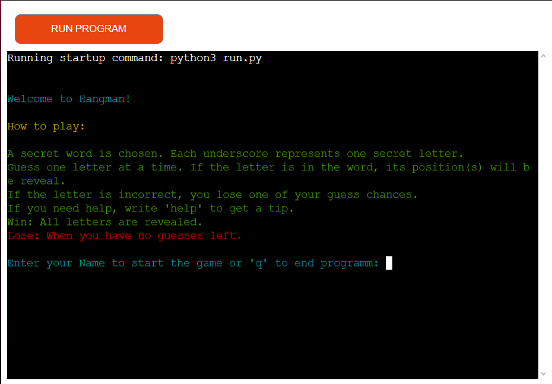
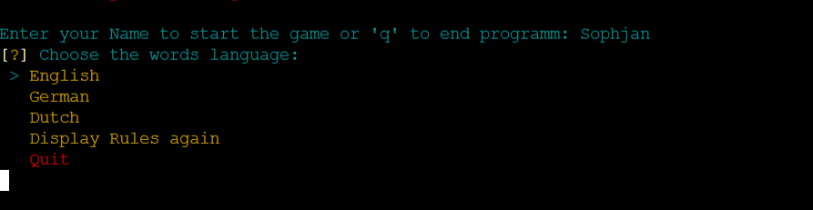
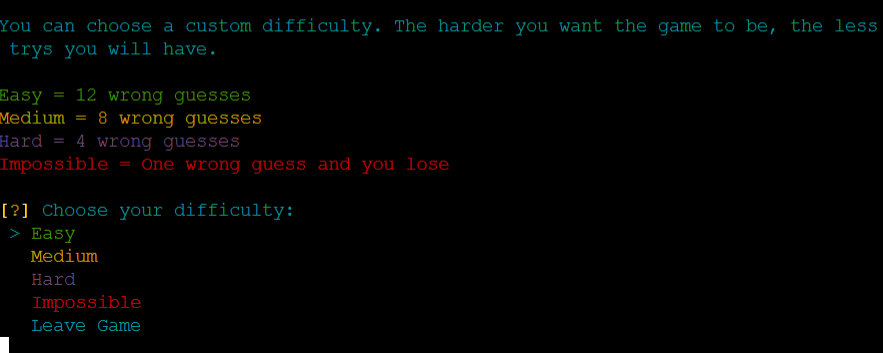
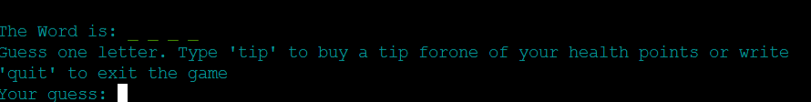
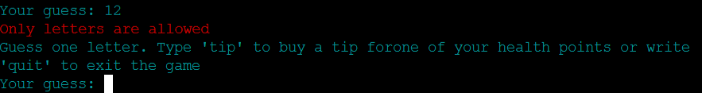
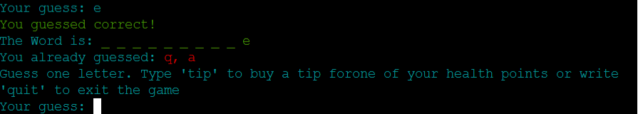
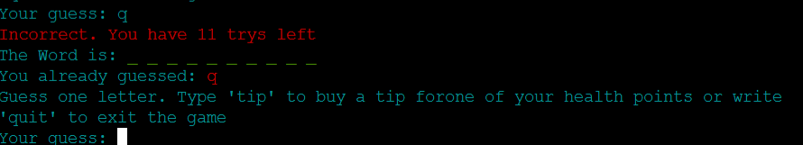
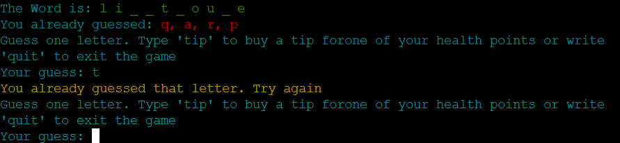
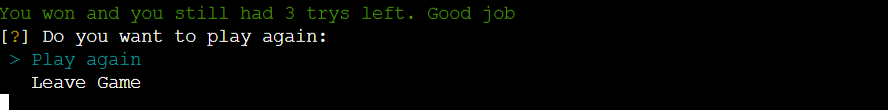
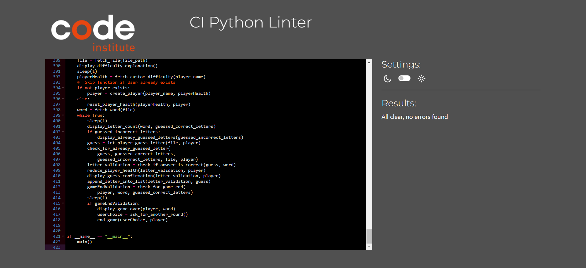

# Hangman



## Descripttion

**Hangman** is a classic word-guessing game where one player thinks of a word, and the other tries to guess it by suggesting letters. The word is represented by a series of blank spaces, with each space corresponding to a letter. If the guessing player suggests a correct letter, it is revealed in its correct position(s). If they guess incorrectly, a part of a stick figure is drawn on a gallows. The game continues until the word is fully guessed or the drawing of the hangman is completed, resulting in a loss. Hangman is often played as a fun and educational game to improve vocabulary and spelling skills.

## Live Version

Experience the game firsthand: [Play Hangman here!](https://hangman-pp3-13b044889c95.herokuapp.com)


















## Features

### Core Gameplay Mechanics

- **Word Selection**:

  - A random word is chosen from a JSON file, supporting multiple languages (English, German, Dutch).
  - Each word comes with a hint that can be purchased using a health point.

- **Turn-Based Letter Guessing**:

  - Players guess one letter at a time.
    

  - Correct guesses reveal the letter in the word.
    

  - Incorrect guesses decrease the player's health.
    

- **Difficulty Levels**:

  - Players can choose between four difficulty levels:
    - **Easy**: 12 wrong guesses allowed.
    - **Medium**: 8 wrong guesses allowed.
    - **Hard**: 4 wrong guesses allowed.
    - **Impossible**: Only one mistake is allowed.
  - In the **Impossible** mode, hints are disabled for an extreme challenge.
    

- **Hint System**:

  - Players can buy a hint in exchange for one health point.
  - If already purchased, the hint can be reviewed anytime.

- **Letter Tracking**:
  - Correctly and incorrectly guessed letters are stored and displayed to help players avoid duplicate guesses.
    

### User Interface and Experience

- **Dynamic Feedback**:

  - Messages and prompts guide the player through the game.
  - Color-coded responses indicate correct (green) and incorrect (red) guesses.

- **Multilingual Support**:

  - The game allows players to choose from different language-based word sets.
    

- **Player Customization**:

  - Players enter their name for a personalized experience.
    

  - Health points vary based on the selected difficulty.
    

- **Replayability**:
  - After a game ends (win or lose), players can choose to restart with a new word.
    

## Workprocess

### Planning & Design

The development of the Hangman game started with conceptual planning. Using Mimo, a rough flowchart was created to outline the game's structure. The **Player** class was designed with essential attributes such as:

- `self.name` – Stores the player's name.
- `self.health` – Represents the remaining attempts.
- `guessLetter()` – A method for handling letter guesses.

### Word Selection & APIs

To dynamically fetch words, different APIs were considered and tested. The following sources were explored:

- [Dictionary API](https://dictionaryapi.dev)
- [Free Dictionary API](https://publicapi.dev/free-dictionary-api)
- [Random Word API](https://random-word-api.vercel.app)
- [API Ninjas - Random Word](https://www.api-ninjas.com/api/randomword)
- [Random Words GitHub Repository](https://github.com/mcnaveen/Random-Words-API)

However, the API that was supposed to generate a random word along with its description encountered internal issues (HTTP 500 status). Additionally, integrating **Random Word APIs** with **Dictionary APIs** proved problematic, as some generated words were not found in the dictionary.

To ensure stability and reliability, JSON files were used instead. JSON is a structured and immutable data format in Python, meaning its content cannot be modified directly during execution. This made it an ideal choice for storing predefined words along with their descriptions, ensuring consistency across different game sessions. By using a JSON file, I could avoid API failures, maintain control over the word list, and ensure that each word had a valid definition.

### Custom Word List

Due to these limitations, I decided to create my own curated word list instead. This ensured better control over word selection and guaranteed that each word had a corresponding definition.

### Refactoring the Guess Function

Initially, the `guessLetter()` function was a method within the **Player** class. However, to improve self-referencing and maintain cleaner code, the function was refactored and moved outside of the class.

### Implementation

With the structure in place, coding began by implementing the **Player** class and integrating the word-fetching mechanisms. Further steps involved developing game logic, input validation, and user feedback.

### Testing & Refinement

The game underwent multiple testing phases to ensure smooth gameplay and accurate word validation. Adjustments were made to improve user experience, error handling, and overall performance.

## Technologies Used

- **Languages**:

  - Python
  - Json

- **Version Control**:

  - Git: Used for version control to track changes and manage the development process.
  - GitHub: Used as a cloud-based platform to store and share the code repository.
  - Heroku: The game is deployed on Heroku, allowing easy access and testing in a live environment.

- **Other Technology**
  - Miro: Used for planning and visualizing game structure, creating flowcharts, and collaborating on gameplay mechanics.

## Setup & Installation

### Prerequisites

To run Hangman locally, ensure you have:

- **Python 3.x** installed on your machine. You can download it from [python.org](https://www.python.org/downloads/).
- **Git** installed to clone the repository. Download it from [git-scm.com](https://git-scm.com/).

### Installation

1. **Clone the repository**  
   Open a terminal and run:
   ```sh
   git clone https://github.com/your-username/hangman.git
   ```
2. **Navigate to the folder**
   ```Sh
   cd hangman
   ```
3. **Create and activate a virtual environment**

   This ensures that all dependencies are installed in an isolated environment and do not clutter your global Python installation.

- On Windows
  ```sh
  python -m venv venv
  venv\Scripts\activate
  ```
- On macOS/Linux:
  ```sh
  python -m venv venv
  venv\Scripts\activate
  ```

4. **Install dependencies**

   Instead of installing libraries manually, install all required dependencies from the requirements.txt file:

   ```sh
   pip install -r requirements.txt
   ```

5. **Run the game**

Open the `hangman.py` file in your preferred text editor or IDE and run it:

```sh
python hangman.py
```

#### Deactivating the Virtual Environment

Once you are done, you can deactivate the virtual environment by running:

```sh
deactivate
```

### How to Play

- Run the game by executing the hangman.py file:

```
python run.py
```

- Follow the on-screen instructions to:
  - Enter your name.
  - Choose a language for the words.
  - Select a difficulty level.
  - Guess letters to uncover the hidden word.

Feel free to modify the code or assets to your liking and explore the different features of the game!

### Deployment

To deploy the project via GitHub Pages:

1. Push the repository to your GitHub account.
2. Go to the repository’s settings and navigate to the **Pages** section.
3. Select the `main` branch and save changes.
4. Your game will be live at `https://<your-github-username>.github.io/hangman`.

## Testing and Validation

### Functionality Testing

- **Input Validation:** Ensured that player name input is restricted to letters only and does not allow spaces or special characters.
- **Language Selection:** Tested the language selection process to ensure that the correct word lists are loaded and the user interface updates accordingly.
- **Difficulty Selection:** Tested the different difficulty levels to verify that the number of attempts is set correctly and impacts gameplay.
- **Letter Recognition:** Verified that the game correctly identifies whether a letter is in the word or not and provides appropriate feedback.
- **Gameplay Flow:** Tested the entire gameplay flow, from word selection and letter guessing to winning or losing the game.

### Code Validation

- [CI Python Linter:](https://pep8ci.herokuapp.com/) The Python code was checked for syntax errors and other potential issues to ensure that it runs without errors.
  
- Libraries: Verified that all used libraries (such as colorama, inquirer, and json) are correctly installed and function properly.

## Bugs Encountered, Solutions, and General Observations

### Bugs Encountered

During the development of Hangman, several challenges and bugs were encountered. Below is a summary of the most significant ones:

- Issues with External APIs:

  - **Problem:** Difficulty integrating with external Random Word APIs and Dictionary APIs due to inconsistencies in data. Some words returned by the Random Word API were not found in the Dictionary API, causing errors.
  - **Solution:** Opted to create a custom word list stored locally in a JSON file. This ensured consistency and control over the word selection process.

- Cross-Platform Compatibility:

  - **Problem:** The simple-term-menu library, which was initially considered for creating interactive menus, proved to be incompatible with the Windows operating system.
  - **Solution:** Implemented the inquirer library as an alternative for creating interactive menus. This library provided cross-platform compatibility, ensuring that the menus function correctly on Windows as well.

- General Observations
  - **Data Consistency:** The decision to use a custom word list improved the reliability of the game by ensuring that all words have corresponding definitions and are suitable for the game.
  - **User Experience:** The use of the colorama library enhanced the user experience by adding color and visual appeal to the game's interface.

## Future Plans

While Hangman is currently a functional and enjoyable game, there are some avenues for future development that could enhance the gameplay experience. These include:

- **More Word Lists:** Expanding the variety of words by adding more word lists, potentially with different themes or categories, would increase replayability.
- **Hints and Clues:** Adding more creative and helpful hints or clues for the words would make the game more accessible and enjoyable.
- **Thematic Content:** Incorporating thematic content, such as by using words related to a specific topic or adding visual elements that match the theme, could create a more cohesive experience.
- **Player Progress Tracking**:  
  Implement a feature that allows players to track their progress and
  use **Google Tables** to store game data, making it accessible via commands.

## Credits

**Creative Content**

- **ChatGpt**: Creating a word and tip list for different languages
- **Miro**: [Miro](https://miro.com/de/) was my tool to create and visualize my pseudo-code

**Content and Tutorials**

- **Stack Overflow**: All kinds of different questions and anwsers from [Stack Overflow](https://stackoverflow.com/).

**Code Validation and Development Tools**

- **Python Linter**: Code validation conducted using [CI Python Linter](https://pep8ci.herokuapp.com/#).
- **Git**: Version control handled with [Git](https://git-scm.com/).
- **GitHub**: Cloud-based platform for storing and sharing code via [GitHub](https://github.com/).
- **Heroku**: Used for deploying and hosting the game, enabling live testing and accessibility on [Heroku](https://www.heroku.com/home).
- **VS Studio Code**: Text editor for coding

**Mentoring and Guidance**

- **Iuliia Konovalova**: Mentoring and guidance by [Iuliia Konovalova](https://github.com/IuliiaKonovalova).
